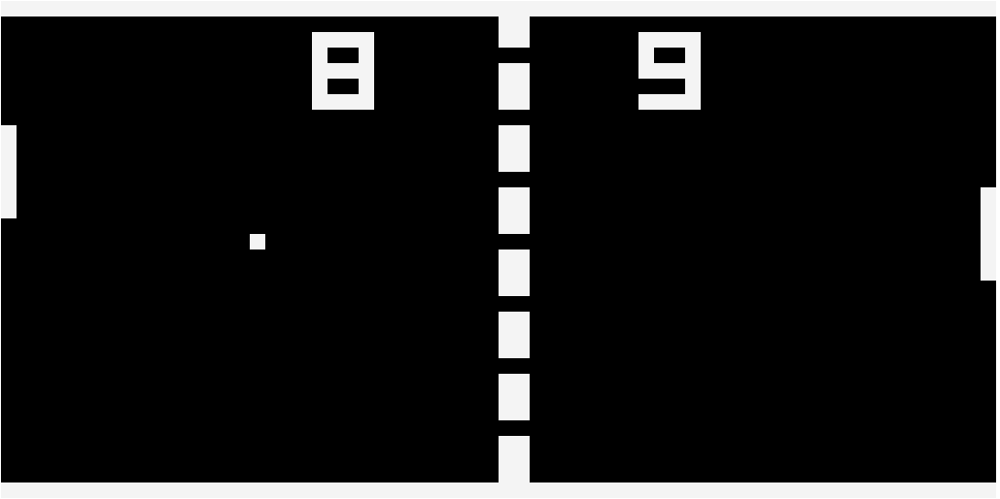

# CHIP-8 Emulator

This is an emulator I made for the CHIP-8 instruction set to play little ROM games. I really enjoy creating a system to interpret
and run other things and this was a fun and not too difficult project that I would recommend to others! I did this in C++ with Raylib to learn more about it and especially the WASM target with Emscripten.


## Building
You can build this either for desktop, or for the web. You should have CMake installed and available via PATH for both targets, and the Emscripten SDK installed for the web target.
### Desktop
Run the following commands in a bash shell:
```bash
git clone https://github.com/enortho/chip8.git
cd chip8
mkdir build
cd build
cmake ..
cmake --build .
```

This should build the executable, which should be named `chip8`. To run it, feed in your ROM file via stdin. For example, if you `cd ..` back into the root folder of the project: `./build/chip8 < roms/PONG2` will run PONG.

### Web
There is a deployment for the web version already [here](https://enortho.github.io/chip8) if you just want to demo the project and see it yourself. You can nab the compiled files with your browser's devtools and avoid compiling this whole thing as well.

If you want to compile it from scratch run the following commands in a bash shell:
```bash
git clone https://github.com/enortho/chip8.git
cd chip8
emcmake cmake -B build-web -S .
cmake --build build-web
```
This creates `chip8.js`, `chip8.wasm`, and `chip8.data` in `build-web`, which are the three main files you need. `web/index.html` is copied to the build directory as well, to give an entry point.

You then need to serve the files with some kind of web server. I usually invoke `python3 -m http.server --directory build-web` for this, and then visit `localhost:8000` to see the app.

